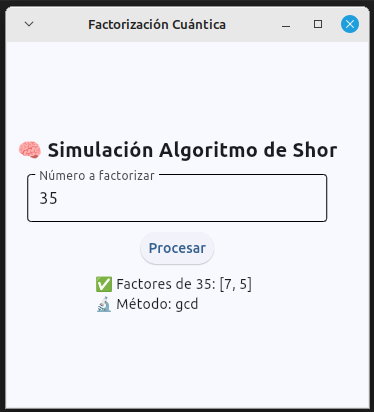

# ⚛️ Quantum Factorizer

Una app educativa que simula el algoritmo cuántico de **Shor** para factorizar números enteros, mostrando el contraste entre métodos clásicos y cuánticos.

---

## 🎯 Objetivo

Demostrar, de forma interactiva, cómo **la computación cuántica puede poner en jaque la criptografía actual** basada en RSA, mediante la factorización de números compuestos.

---

## 🛠️ Tecnologías

- `Python 3.10`
- `FastAPI`: API para procesar números y ejecutar el algoritmo.
- `Qiskit`: simulación del algoritmo cuántico de Shor.
- `Flet`: frontend interactivo multiplataforma.
- `Uvicorn`: servidor ASGI para desarrollo en local.

---

## 🖼️ Captura de pantalla



---

## 🚀 Instalación

1. Clona el repositorio:

```bash
git clone https://github.com/luisforni/quantum_factorizer.git
cd quantum_factorizer
```

2. Crea y activa un entorno virtual:

```bash
python -m venv venv
source venv/bin/activate  # En Windows: venv\Scripts\activate
```

3. Instala las dependencias:

```bash
pip install -r requirements.txt
```

4. Ejecuta el backend con FastAPI y Uvicorn:

```bash
uvicorn backend.main:app --reload
```

5. Ejecuta el frontend con Flet:

```bash
python -m frontend.main
```

---

## 📘 Créditos

Proyecto desarrollado por Luis Forni.

---

## 🧪 Licencia

MIT License